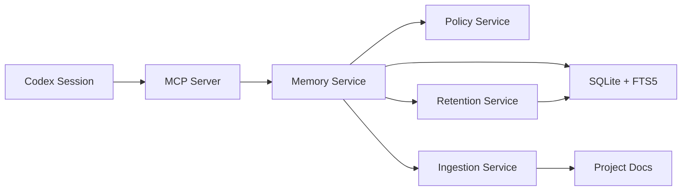

# codex-mem

Persistent local memory for Codex workflows, built on MCP + SQLite.

[](https://github.com/Just-Boring-Cat/codex-mem/actions/workflows/ci.yml)
[](LICENSE)
[](package.json)

`codex-mem` keeps project context across sessions with a token-efficient retrieval workflow:

1. Save high-value memory entries.
2. Search compact index results.
3. Explore timeline around relevant anchors.
4. Fetch full details only for selected IDs.

## Why codex-mem

- Local-first and private by default.
- Fast keyword retrieval with SQLite FTS5.
- Explicit policy checks for sensitive content.
- Ingestion and retention workflows built into tools.
- Test-covered migrations and error paths.

## Architecture



## Quick Start

```bash
npm install
npm run migrate
npm run mcp:start
```

## VS Code Extension MCP Config

Use this MCP server command in your Codex extension config:

```json
{
  "mcpServers": {
    "codex-mem": {
      "command": "npm",
      "args": ["run", "mcp:start", "--silent"],
      "cwd": "/absolute/path/to/codex-mem"
    }
  }
}
```

## Tool Demo

`save_memory`

```json
{
  "text": "MVP release gate passed with 21 tests green.",
  "title": "Release Gate",
  "project": "codex-mem",
  "type": "decision",
  "source_ref": "manual"
}
```

`search`

```json
{
  "query": "release gate",
  "project": "codex-mem",
  "limit": 10
}
```

`ingest_docs`

```json
{
  "project": "codex-mem",
  "sources": ["docs/session-log.md", "docs/decisions.md", "docs/requirements.md"]
}
```

`retention_dry_run`

```json
{
  "project": "codex-mem",
  "max_age_days": 30,
  "max_entries_per_project": 200
}
```

## Available MCP Tools

- `save_memory`
- `search`
- `timeline`
- `get_entries`
- `ingest_docs`
- `retention_dry_run`

## Maintenance Commands

```bash
npm run ingest
RETENTION_MAX_AGE_DAYS=30 RETENTION_MAX_ENTRIES_PER_PROJECT=200 npm run retention:dry-run
```

## Validation

```bash
npm run lint
npm run typecheck
npm test
npm run audit:prod
```

Full dependency visibility:

```bash
npm run audit:all
```

## Documentation

- `docs/setup-guide.md`
- `docs/usage-guide.md`
- `docs/mcp-api-spec.md`
- `docs/architecture.md`
- `docs/data-model.md`
- `docs/security-baseline.md`
- `docs/operations-runbook.md`

## Contributing

See `CONTRIBUTING.md`.
