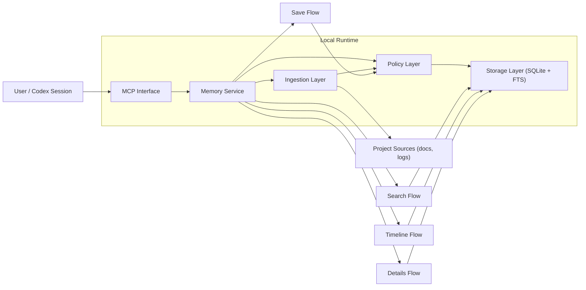

<p align="center">
  
</p>

<p align="center">
  
</p>

<p align="center"><strong>Persistent memory MCP server for Codex, local-first and SQLite-backed.</strong></p>

<p align="center">
  <a href="README.md">🇺🇸 English</a> •
  <a href="docs/i18n/README.es.md">🇪🇸 Español</a> •
  <a href="docs/i18n/README.de.md">🇩🇪 Deutsch</a>
</p>

<p align="center">
  <a href="https://github.com/Just-Boring-Cat/codex-mem/actions/workflows/ci.yml"></a>
  <a href="LICENSE"></a>
  <a href="package.json"></a>
</p>

<p align="center">
  <a href="#quick-start">Quick Start</a> •
  <a href="#documentation">Documentation</a> •
  <a href="#architecture-design">Architecture Design</a> •
  <a href="#how-it-works">How It Works</a> •
  <a href="#mcp-search-tools">MCP Search Tools</a> •
  <a href="#system-requirements">System Requirements</a> •
  <a href="#contributing">Contributing</a> •
  <a href="#license">License</a>
</p>

---

`codex-mem` preserves project memory across Codex sessions with a practical progressive retrieval workflow.

## Quick Start

```bash
npm install
export MEMORY_DB_PATH=.memory/codex-mem.db
npm run migrate
npm run mcp:start
```

VS Code MCP setup values:

- Name: `codex-mem`
- Transport: `STDIO`
- Command: `npm`
- Arguments: `run`, `mcp:start`, `--silent`
- Environment variable: `MEMORY_DB_PATH=.memory/codex-mem.db`
- Working directory: absolute path to your `codex-mem` repository

## Documentation

### Root

- [README.md](README.md)
- [CONTRIBUTING.md](CONTRIBUTING.md)
- [LICENSE](LICENSE)

### Docs Index

- [docs/README.md](docs/README.md)

### Planning and Product

- [docs/project-plan.md](docs/project-plan.md)
- [docs/requirements.md](docs/requirements.md)
- [docs/mvp-spec.md](docs/mvp-spec.md)
- [docs/delivery-plan.md](docs/delivery-plan.md)
- [docs/implementation-kickoff.md](docs/implementation-kickoff.md)

### Architecture and Design

- [docs/architecture.md](docs/architecture.md)
- [docs/architecture-diagram.mmd](docs/architecture-diagram.mmd)
- [docs/data-model.md](docs/data-model.md)
- [docs/data-model-diagram.mmd](docs/data-model-diagram.mmd)
- [docs/technical-design.md](docs/technical-design.md)
- [docs/runtime-decision.md](docs/runtime-decision.md)

### API and Operations

- [docs/mcp-api-spec.md](docs/mcp-api-spec.md)
- [docs/setup-guide.md](docs/setup-guide.md)
- [docs/usage-guide.md](docs/usage-guide.md)
- [docs/troubleshooting.md](docs/troubleshooting.md)
- [docs/operations-runbook.md](docs/operations-runbook.md)
- [docs/security-baseline.md](docs/security-baseline.md)
- [docs/test-strategy.md](docs/test-strategy.md)

### Project Logs

- [docs/decisions.md](docs/decisions.md)
- [docs/session-log.md](docs/session-log.md)

### Internationalization

- [docs/i18n/README.es.md](docs/i18n/README.es.md)
- [docs/i18n/README.de.md](docs/i18n/README.de.md)

### Brand Assets

- [docs/public/codex-mem.png](docs/public/codex-mem.png)
- [docs/public/codex-mem-wordmark.svg](docs/public/codex-mem-wordmark.svg)

## Architecture Design



## How It Works

1. `save_memory` stores key decisions, fixes, and constraints.
2. `search` returns compact index entries for low-cost discovery.
3. `timeline` expands context around anchor entries.
4. `get_entries` fetches full details only for selected IDs.
5. `ingest_docs` imports docs with source/hash dedupe.
6. `retention_dry_run` reports cleanup candidates without deleting data.

## MCP Search Tools

Recommended retrieval flow:

1. `search`
2. `timeline`
3. `get_entries`

Available MCP tools:

- `save_memory`
- `search`
- `timeline`
- `get_entries`
- `ingest_docs`
- `retention_dry_run`

## System Requirements

- Node.js 20+
- npm
- Local filesystem write access for `.memory/`
- SQLite runtime support (via bundled dependency)

## Contributing

1. Fork the repository
2. Create a feature branch
3. Add or update tests
4. Update docs for behavior changes
5. Open a pull request

See [CONTRIBUTING.md](CONTRIBUTING.md).

## License

Licensed under **AGPL-3.0**.

See [LICENSE](LICENSE).
