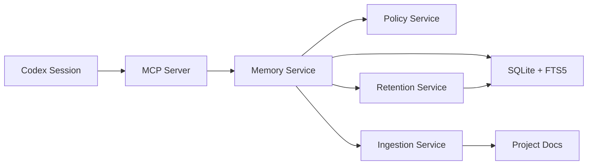

<h1 align="center">codex-mem</h1>

<p align="center"><strong>Persistent memory MCP server for Codex, local-first and SQLite-backed.</strong></p>

<p align="center">
  <a href="README.md"><strong>English</strong></a> |
  <a href="docs/i18n/README.es.md"><strong>Espanol</strong></a> |
  <a href="docs/i18n/README.de.md"><strong>Deutsch</strong></a>
</p>

<p align="center">
  <a href="https://github.com/Just-Boring-Cat/codex-mem/actions/workflows/ci.yml"></a>
  <a href="LICENSE"></a>
  <a href="package.json"></a>
</p>

<p align="center">
  <a href="#quick-start">Quick Start</a> |
  <a href="#vscode-mcp-setup">VS Code MCP Setup</a> |
  <a href="#mcp-tools">MCP Tools</a> |
  <a href="#manual-verification">Manual Verification</a> |
  <a href="#documentation">Documentation</a>
</p>

---

`codex-mem` keeps project context across sessions with a practical workflow:

1. Save high-value context with `save_memory`.
2. Search compact results with `search`.
3. Expand local context around anchors with `timeline`.
4. Fetch full details for selected IDs with `get_entries`.

## Why codex-mem

- Codex sessions are stateless by default.
- Decisions, bug fixes, and constraints get lost between sessions.
- This MCP server adds a local memory layer with explicit tools.

## Core Features

- Local SQLite persistence (`.memory/*.db`)
- Six MCP tools for memory write, retrieval, and operations
- Document ingestion with source/hash dedupe
- Retention dry-run analysis without destructive deletion
- Secret-pattern policy checks before persistence
- Contract tests for stable MCP behavior

## Architecture



## Quick Start

```bash
npm install
export MEMORY_DB_PATH=.memory/codex-mem.db
npm run migrate
npm run mcp:start
```

Compatibility fallback is supported:

- `CODEX_MEM_DB_PATH`

## VS Code MCP Setup

Use **Connect to a custom MCP** with these fields:

- Name: `codex-mem`
- Transport: `STDIO`
- Command to launch: `npm`
- Arguments:
  - `run`
  - `mcp:start`
  - `--silent`
- Environment variables:
  - `MEMORY_DB_PATH=.memory/codex-mem.db`
- Working directory:
  - Absolute path to this repository

Example working directory:

- `/Users/hgeorge/Downloads/DEVELOPMENT/codex-mem`

## MCP Tools

- `save_memory`: save normalized memory entries
- `search`: retrieve compact indexed results
- `timeline`: fetch surrounding entries around an anchor
- `get_entries`: fetch full payloads for selected IDs
- `ingest_docs`: ingest docs with dedupe
- `retention_dry_run`: analyze retention candidates without deleting data

Contract: `docs/mcp-api-spec.md`

## Manual Verification

In any Codex session connected to this MCP server:

1. Save a marker:

```text
Use save_memory with text "manual-check-<timestamp>" and project "manual-check"
```

2. Search it:

```text
Use search with query "manual-check-<timestamp>" and project "manual-check"
```

3. Fetch details:

```text
Use get_entries with the returned id
```

4. Confirm cross-session persistence:

- Open a new session
- Run the same `search`
- If found, persistence is verified

## Common Commands

```bash
npm run lint
npm run typecheck
npm run test
npm run test:perf
npm run ingest
npm run retention:dry-run
npm run audit:prod
npm run audit:all
```

## Data and Security Notes

- Do not store secrets, credentials, or private personal data.
- Secret-like patterns are blocked by policy checks.
- Keep `.memory/` local and untracked.
- Security baseline: `docs/security-baseline.md`

## Documentation

- `docs/README.md`
- `docs/setup-guide.md`
- `docs/usage-guide.md`
- `docs/troubleshooting.md`
- `docs/operations-runbook.md`
- `docs/architecture.md`
- `docs/data-model.md`
- `docs/mvp-spec.md`

## Contributing

See `CONTRIBUTING.md`.
