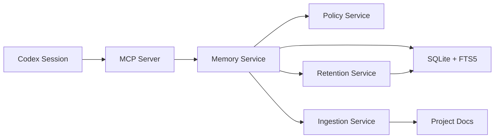

# codex-mem

Persistent memory MCP server for Codex, local-first and SQLite-backed.

[](https://github.com/Just-Boring-Cat/codex-mem/actions/workflows/ci.yml)
[](LICENSE)
[](package.json)

`codex-mem` helps you carry technical context across sessions with a simple memory workflow:
`save_memory -> search -> timeline -> get_entries`.

## Why This Exists

- Codex sessions are stateless by default.
- Project decisions, fixes, and constraints get lost between sessions.
- This server provides explicit memory tools so context can be captured and reused safely.

## Core Features

- Local SQLite persistence (`.memory/*.db`)
- MCP tools for write, search, context expansion, and detail retrieval
- Document ingestion with source/hash dedupe
- Retention dry-run analysis without deletion
- Policy filter for secret-like token patterns
- Contract tests for MCP tool behavior

## Architecture



## Quick Start

### 1. Install

```bash
npm install
```

### 2. Configure DB path

Recommended local path:

```bash
export MEMORY_DB_PATH=.memory/codex-mem.db
```

Compatibility fallback is also supported:

- `CODEX_MEM_DB_PATH`

### 3. Run migration

```bash
npm run migrate
```

### 4. Start MCP server

```bash
npm run mcp:start
```

## Connect in VS Code Codex Extension

Use **Custom MCP (STDIO)** with these values:

- Name: `codex-mem`
- Command to launch: `npm`
- Arguments:
  - `run`
  - `mcp:start`
  - `--silent`
- Environment variables:
  - `MEMORY_DB_PATH` = `.memory/codex-mem.db`
- Working directory:
  - Absolute path to this repository
  - Example: `/Users/hgeorge/Downloads/DEVELOPMENT/codex-mem`

Notes:

- Keep `MEMORY_DB_PATH` relative to the selected working directory, or use an absolute DB path.
- If tools do not appear, restart the MCP connection after saving config.

## MCP Tools

- `save_memory`: Save a normalized memory entry.
- `search`: Search compact indexed entries.
- `timeline`: Fetch nearby entries around an anchor ID.
- `get_entries`: Fetch full entry payloads by IDs.
- `ingest_docs`: Ingest selected docs with dedupe.
- `retention_dry_run`: Produce retention candidates without deletion.

Contract details: `docs/mcp-api-spec.md`

## Manual Verification (No Test Runner)

In any Codex session connected to this MCP server:

1. Save a marker

```text
Use save_memory with text "manual-check-<timestamp>" and project "manual-check"
```

2. Search for it

```text
Use search with query "manual-check-<timestamp>" and project "manual-check"
```

3. Fetch detail

```text
Use get_entries with the returned id
```

4. Cross-session verification

- Open a new Codex session.
- Run `search` with the same marker.
- If found, persistence across sessions is confirmed.

## Common Commands

```bash
npm run lint
npm run typecheck
npm run test
npm run test:perf
npm run ingest
npm run retention:dry-run
npm run audit:prod
```

Full dependency visibility:

```bash
npm run audit:all
```

## Data and Security Notes

- Do not store real secrets, credentials, or private personal data in memory.
- Secret-like payloads are blocked by policy checks.
- Keep `.memory/` out of git (already ignored).
- Review baseline controls in `docs/security-baseline.md`.

## Documentation

- `docs/README.md`: documentation map
- `docs/setup-guide.md`: setup and MCP wiring
- `docs/usage-guide.md`: daily workflows and patterns
- `docs/troubleshooting.md`: issue diagnosis and fixes
- `docs/operations-runbook.md`: backup, restore, and incident playbooks
- `docs/architecture.md`: architecture overview
- `docs/data-model.md`: data entities and storage model
- `docs/mvp-spec.md`: MVP contract and scope

## Contributing

See `CONTRIBUTING.md`.
