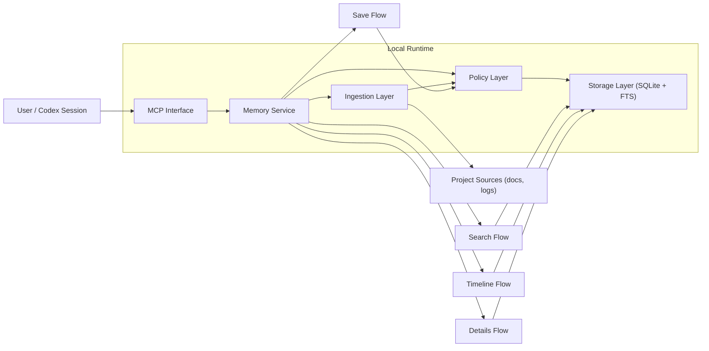

<p align="center">
  
</p>

<p align="center">
  
</p>

<p align="center"><strong>Persistenter MCP-Memory-Server fuer Codex, local-first und mit SQLite gespeichert.</strong></p>

<p align="center">
  <a href="../../README.md">🇺🇸 English</a> •
  <a href="README.es.md">🇪🇸 Español</a> •
  <a href="README.de.md">🇩🇪 Deutsch</a>
</p>

<p align="center">
  <a href="https://github.com/Just-Boring-Cat/codex-mem/actions/workflows/ci.yml"></a>
  <a href="../../LICENSE"></a>
  <a href="../../package.json"></a>
</p>

<p align="center">
  <a href="#schnellstart">Schnellstart</a> •
  <a href="#dokumentation">Dokumentation</a> •
  <a href="#architekturdesign">Architekturdesign</a> •
  <a href="#wie-es-funktioniert">Wie Es Funktioniert</a> •
  <a href="#mcp-suchtools">MCP Suchtools</a> •
  <a href="#systemanforderungen">Systemanforderungen</a> •
  <a href="#mitwirken">Mitwirken</a> •
  <a href="#lizenz">Lizenz</a>
</p>

---

`codex-mem` behaelt Projektkontext ueber Codex-Sitzungen hinweg mit einem progressiven Retrieval-Workflow.

## Schnellstart

Automatische Installation mit einem Befehl:

```bash
npm run mcp:install
```

Installer-Optionen:

```bash
bash scripts/install-mcp.sh --help
bash scripts/install-mcp.sh --dry-run
bash scripts/install-mcp.sh --dry-run --no-register
bash scripts/install-mcp.sh --name codex-mem --db-path .memory/codex-mem.db
```

Manueller Pfad:

```bash
npm install
export MEMORY_DB_PATH=.memory/codex-mem.db
npm run migrate
npm run mcp:start
```

Werte fuer die MCP-Konfiguration in VS Code:

- Name: `codex-mem`
- Transport: `STDIO`
- Kommando: `npm`
- Argumente: `run`, `mcp:start`, `--silent`
- Umgebungsvariable: `MEMORY_DB_PATH=.memory/codex-mem.db`
- Arbeitsverzeichnis: absoluter Pfad zum `codex-mem` Repository

## Dokumentation

### Root

- [README.md](../../README.md)
- [CONTRIBUTING.md](../../CONTRIBUTING.md)
- [LICENSE](../../LICENSE)
- [scripts/install-mcp.sh](../../scripts/install-mcp.sh)

### Docs-Index

- [docs/README.md](../README.md)

### Planung und Produkt

- [docs/project-plan.md](../project-plan.md)
- [docs/requirements.md](../requirements.md)
- [docs/mvp-spec.md](../mvp-spec.md)
- [docs/delivery-plan.md](../delivery-plan.md)
- [docs/implementation-kickoff.md](../implementation-kickoff.md)

### Architektur und Design

- [docs/architecture.md](../architecture.md)
- [docs/architecture-diagram.mmd](../architecture-diagram.mmd)
- [docs/data-model.md](../data-model.md)
- [docs/data-model-diagram.mmd](../data-model-diagram.mmd)
- [docs/technical-design.md](../technical-design.md)
- [docs/runtime-decision.md](../runtime-decision.md)

### API und Betrieb

- [docs/mcp-api-spec.md](../mcp-api-spec.md)
- [docs/setup-guide.md](../setup-guide.md)
- [docs/usage-guide.md](../usage-guide.md)
- [docs/troubleshooting.md](../troubleshooting.md)
- [docs/operations-runbook.md](../operations-runbook.md)
- [docs/security-baseline.md](../security-baseline.md)
- [docs/test-strategy.md](../test-strategy.md)

### Projektprotokolle

- [docs/decisions.md](../decisions.md)
- [docs/session-log.md](../session-log.md)

### Internationalisierung

- [docs/i18n/README.es.md](README.es.md)
- [docs/i18n/README.de.md](README.de.md)

### Markenassets

- [docs/public/codex-mem.png](../public/codex-mem.png)
- [docs/public/codex-mem-wordmark.svg](../public/codex-mem-wordmark.svg)

## Architekturdesign



## Wie Es Funktioniert

1. `save_memory` speichert wichtige Entscheidungen, Fixes und Randbedingungen.
2. `search` liefert kompakte Index-Treffer fuer guenstige Suche.
3. `timeline` erweitert Kontext um relevante Ankereintraege.
4. `get_entries` laedt volle Details nur fuer ausgewaehlte IDs.
5. `ingest_docs` importiert Dokumente mit Source/Hash-Deduplizierung.
6. `retention_dry_run` meldet Bereinigungskandidaten ohne Loeschung.

## MCP Suchtools

Empfohlener Ablauf:

1. `search`
2. `timeline`
3. `get_entries`

Verfuegbare MCP-Tools:

- `save_memory`
- `search`
- `timeline`
- `get_entries`
- `ingest_docs`
- `retention_dry_run`

## Systemanforderungen

- Node.js 20+
- npm
- Lokaler Schreibzugriff fuer `.memory/`
- SQLite-Unterstuetzung (ueber Abhaengigkeit gebuendelt)

## Mitwirken

1. Repository forken
2. Feature-Branch erstellen
3. Tests ergaenzen oder aktualisieren
4. Dokumentation fuer Aenderungen anpassen
5. Pull Request erstellen

Siehe [CONTRIBUTING.md](../../CONTRIBUTING.md).

## Lizenz

Lizenziert unter **AGPL-3.0**.

Siehe [LICENSE](../../LICENSE).
