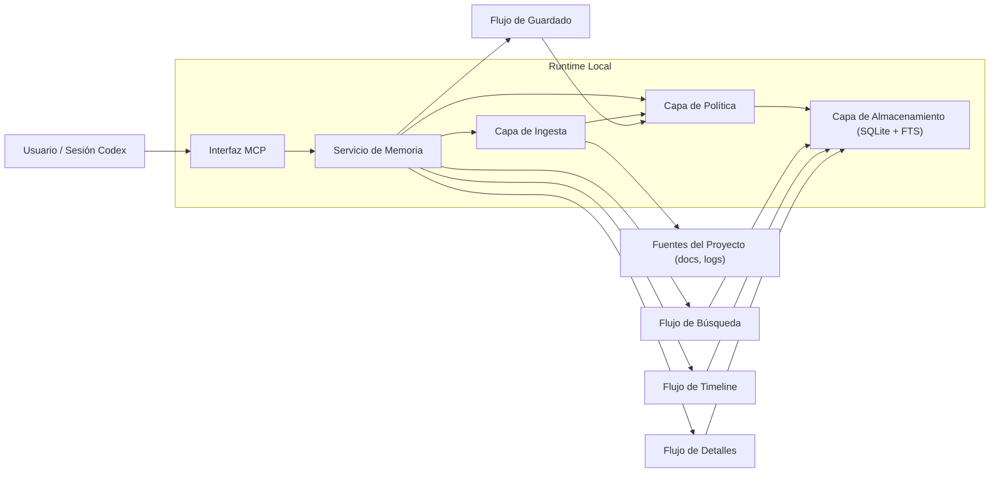

<p align="center">
  
</p>

<p align="center">
  
</p>

<p align="center"><strong>Servidor MCP de memoria persistente para Codex, local-first y respaldado por SQLite.</strong></p>

<p align="center">
  <a href="../../README.md">🇺🇸 English</a> •
  <a href="README.es.md">🇪🇸 Español</a> •
  <a href="README.de.md">🇩🇪 Deutsch</a>
</p>

<p align="center">
  <a href="https://github.com/Just-Boring-Cat/codex-mem/actions/workflows/ci.yml"></a>
  <a href="../../LICENSE"></a>
  <a href="../../package.json"></a>
</p>

<p align="center">
  <a href="#inicio-rápido">Inicio Rápido</a> •
  <a href="#documentación">Documentación</a> •
  <a href="#diseño-de-arquitectura">Diseño de Arquitectura</a> •
  <a href="#cómo-funciona">Cómo Funciona</a> •
  <a href="#herramientas-de-búsqueda-mcp">Herramientas MCP</a> •
  <a href="#requisitos-del-sistema">Requisitos</a> •
  <a href="#contribuciones">Contribuciones</a> •
  <a href="#licencia">Licencia</a>
</p>

---

`codex-mem` conserva el contexto del proyecto entre sesiones de Codex con un flujo progresivo de recuperación.

## Inicio Rápido

Instalación automática en un solo comando:

```bash
npm run mcp:install
```

Opciones del instalador:

```bash
bash scripts/install-mcp.sh --help
bash scripts/install-mcp.sh --dry-run
bash scripts/install-mcp.sh --dry-run --no-register
bash scripts/install-mcp.sh --name codex-mem --db-path .memory/codex-mem.db
```

Ruta manual:

```bash
npm install
export MEMORY_DB_PATH=.memory/codex-mem.db
npm run migrate
npm run mcp:start
```

Valores para configuración MCP en VS Code:

- Nombre: `codex-mem`
- Transporte: `STDIO`
- Comando: `npm`
- Argumentos: `run`, `mcp:start`, `--silent`
- Variable de entorno: `MEMORY_DB_PATH=.memory/codex-mem.db`
- Directorio de trabajo: ruta absoluta del repositorio `codex-mem`

## Documentación

### Raíz

- [README.md](../../README.md)
- [CONTRIBUTING.md](../../CONTRIBUTING.md)
- [LICENSE](../../LICENSE)
- [scripts/install-mcp.sh](../../scripts/install-mcp.sh)
- [SECURITY.md](../../SECURITY.md)
- [CHANGELOG.md](../../CHANGELOG.md)
- [.env.example](../../.env.example)

### Colaboración en GitHub

- [.github/ISSUE_TEMPLATE/bug_report.yml](../../.github/ISSUE_TEMPLATE/bug_report.yml)
- [.github/ISSUE_TEMPLATE/feature_request.yml](../../.github/ISSUE_TEMPLATE/feature_request.yml)
- [.github/ISSUE_TEMPLATE/config.yml](../../.github/ISSUE_TEMPLATE/config.yml)
- [.github/pull_request_template.md](../../.github/pull_request_template.md)

### Índice de docs

- [docs/README.md](../README.md)

### Planificación y producto

- [docs/project-plan.md](../project-plan.md)
- [docs/requirements.md](../requirements.md)
- [docs/mvp-spec.md](../mvp-spec.md)
- [docs/delivery-plan.md](../delivery-plan.md)
- [docs/implementation-kickoff.md](../implementation-kickoff.md)

### Arquitectura y diseño

- [docs/architecture.md](../architecture.md)
- [docs/architecture-diagram.mmd](../architecture-diagram.mmd)
- [docs/data-model.md](../data-model.md)
- [docs/data-model-diagram.mmd](../data-model-diagram.mmd)
- [docs/technical-design.md](../technical-design.md)
- [docs/runtime-decision.md](../runtime-decision.md)

### API y operaciones

- [docs/mcp-api-spec.md](../mcp-api-spec.md)
- [docs/setup-guide.md](../setup-guide.md)
- [docs/usage-guide.md](../usage-guide.md)
- [docs/troubleshooting.md](../troubleshooting.md)
- [docs/operations-runbook.md](../operations-runbook.md)
- [docs/security-baseline.md](../security-baseline.md)
- [docs/test-strategy.md](../test-strategy.md)

### Registros del proyecto

- [docs/decisions.md](../decisions.md)
- [docs/session-log.md](../session-log.md)

### Internacionalización

- [docs/i18n/README.es.md](README.es.md)
- [docs/i18n/README.de.md](README.de.md)

### Recursos de marca

- [docs/public/codex-mem.png](../public/codex-mem.png)
- [docs/public/codex-mem-wordmark.svg](../public/codex-mem-wordmark.svg)

## Diseño de Arquitectura



## Cómo Funciona

1. `save_memory` guarda decisiones, fixes y restricciones importantes.
2. `search` devuelve resultados de índice compactos y de bajo costo.
3. `timeline` amplía contexto alrededor de entradas ancla.
4. `get_entries` recupera detalles completos solo de IDs seleccionados.
5. `ingest_docs` importa documentos con deduplicación por fuente/hash.
6. `retention_dry_run` reporta candidatos de limpieza sin borrar datos.

## Herramientas de Búsqueda MCP

Flujo recomendado:

1. `search`
2. `timeline`
3. `get_entries`

Herramientas MCP disponibles:

- `save_memory`
- `search`
- `timeline`
- `get_entries`
- `ingest_docs`
- `retention_dry_run`

## Requisitos del Sistema

- Node.js 20+
- npm
- Permisos de escritura local para `.memory/`
- Soporte de SQLite (incluido vía dependencia)

## Contribuciones

1. Haz fork del repositorio
2. Crea una rama de feature
3. Agrega o actualiza pruebas
4. Actualiza documentación de cambios
5. Abre un pull request

Consulta [CONTRIBUTING.md](../../CONTRIBUTING.md).

## Licencia

Licencia **AGPL-3.0**.

Consulta [LICENSE](../../LICENSE).
